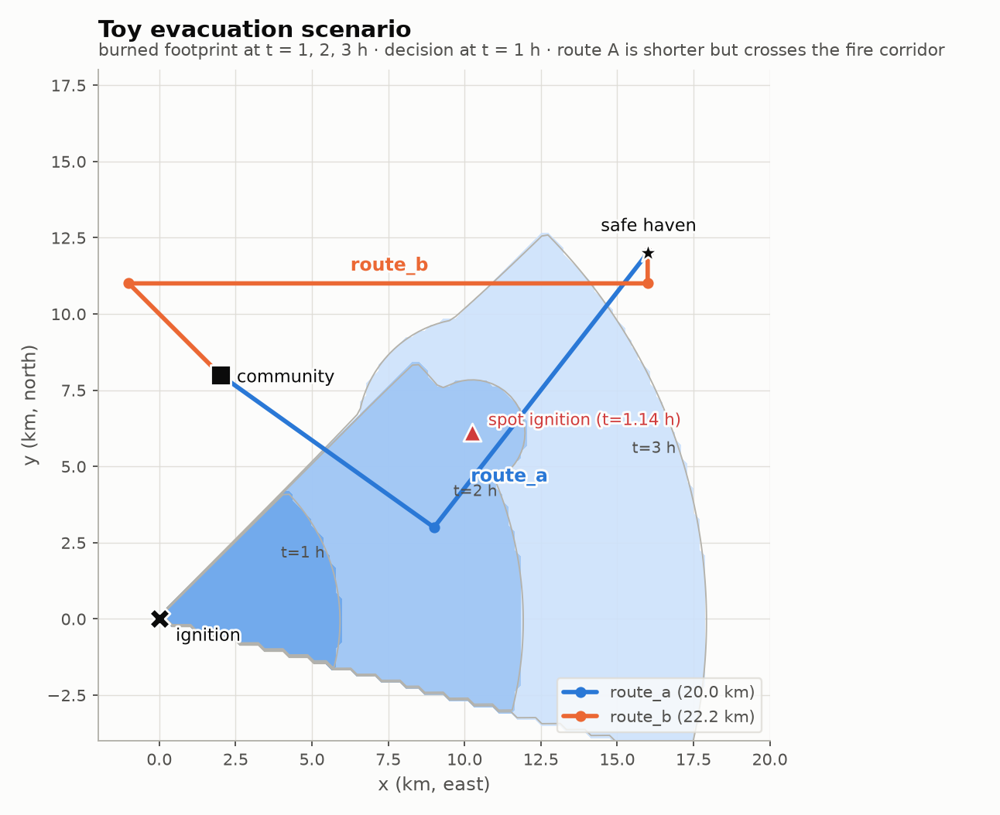

# wildfireguardian-forecast-value

**How good must a wildfire forecast be before it deserves to change a
protective decision?**

This repository develops the experimental mathematics and statistics for
answering that question. It runs entirely on internal synthetic fixtures and
depends on no other WildfireGuardian repository.

> **Nothing here is a claim about real wildfire forecast performance.** Every
> number is produced by a toy model chosen to be hand-checkable. The claim is
> that the *method* works. See [`docs/SCOPE.md`](docs/SCOPE.md).

---

## The distinction this repository exists to make

Wildfire forecast **skill** and wildfire forecast **decision value** are not
the same thing, and they are not monotonically related.

* A forecast can improve traditional prediction metrics without changing the
  correct action.
* A forecast can carry substantial prediction error and still support the same
  correct action.
* A forecast can be perfectly accurate and worth **exactly nothing**, because
  it arrived after the decision was made.

Here is that, measured, on the four hand-designed cases in
[`docs/DECISION_VALUE.md`](docs/DECISION_VALUE.md):

| forecast | footprint CSI | decision value realised |
|---|---|---|
| Case 4 — accurate but 0.5 h late | **1.00** | **0%** |
| Case 2 — `-17°` heading error | 0.65 | 0% (and *harmful* in a faster world: `ΔJ ≈ -50 h`) |
| Case 1 — `+18°` heading error | 0.57 | **100%** |
| Case 4 — degraded but timely | 0.46 | **100%** |
| Case 3 — 60% fast, 3 km displaced, 10° off | **0.40** | **100%** |

**Every forecast that realises all of the available decision value scores
worse on CSI than every forecast that realises none of it.** The ranking is
exactly inverted, and
`tests/test_cases.py::test_skill_ranking_is_inverted_against_value` asserts it
so the claim cannot quietly become false.

Cases 1 and 2 are the sharpest pair: two heading errors of almost the same
magnitude — `+18°` and `-17°` — where the one with the **better** CSI and the
**better** false-alarm ratio is the one that flips the decision to the route
that gets people killed. Arrival-time RMSE is **exactly zero** for both, since
a pure rotation does not change the distance to any cell both fields burn.


---

## The primary demonstration

The break-even frontier — the set where `ΔJ = 0`, i.e. where the forecast and
a forecast-free trigger are worth the same — in the (direction error, latency)
plane:

```text
forecast latency
      ^
      |  trigger better
      |      _____________________
      |     /
      |    /   forecast better
      |   /
      +-------------------------->
            direction error
```

and as actually estimated, with a cluster-bootstrap band:


Read it as: with small direction error the forecast is worth acting on up to
about **1.33 hours** of latency. The frontier then falls away steeply — at
**−15°** it has already dropped to **0.48 hours** — and at **−19°** and beyond
there is **no** latency at which the forecast beats the trigger. Red triangles
mark those four columns; no frontier is drawn through them, because there is
none to draw.

The asymmetry is the finding. A summary reporting `|direction error|` would
have destroyed it.

And skill against value directly, over a direction-error sweep — two settings
with **identical** CSI of 0.64 giving `ΔJ = +17.4 h` and `ΔJ = −2.7 h`:


---

## Install and run

```bash
pip install -e ".[dev]"

wg-forecast-value validate -v          # 13 hand-solvable checks, derivations printed
wg-forecast-value cases                # the four cases
wg-forecast-value run-toy-study        # paired world-level study with full statistics
wg-forecast-value demo                 # every figure, into figures/
pytest -q                              # 277 tests
```

The three commands from the brief:

```bash
wg-forecast-value degrade           config.yaml
wg-forecast-value run-toy-study     config.yaml
wg-forecast-value estimate-frontier results.parquet
```

plus `sweep` (which produces the parquet that `estimate-frontier` consumes),
`cases`, `validate` and `demo`. Ready-to-run configurations are in
[`experiments/manifests/`](experiments/manifests/).

Every command that writes results also writes `manifest.json` — the fully
resolved configuration, scenario, pipeline and error model. A result without a
manifest is not a result.

---

## What is in here

### Forecast degradation operators

Spread-rate error `r' = r(1+ε_r)` · direction error `θ' = θ + ε_θ` · spatial
displacement (`t'(p) = t(p−s)`, exactly) · temporal latency · spotting failure
(missing, delayed, spatially displaced) · correlated combination via a
Gaussian copula.

Each operator's exact behaviour, domain, monotonicity properties and traps are
in [`docs/FORECAST_ERROR_MODEL.md`](docs/FORECAST_ERROR_MODEL.md). Highlights:

* `ε_r = +0.5` and `ε_r = −0.5` are **not** equal and opposite — 1 h of error
  versus 3 h at the same point.
* Direction error on an isotropic source is a no-op, and is skipped
  *explicitly* so the no-op appears in the manifest.
* Errors are **not** assumed independent. `CorrelatedErrorModel.independent()`
  is the named way to assume they are, so that assumption is visible.
* The copula's `R` is **not** the Pearson correlation of the sampled
  parameters. `realised_correlation()` measures it.

### Latency, modelled properly

Three clocks: information time `s`, latency `δ`, decision time `t_d`. The
forecast is in the decision maker's hands iff `s + δ ≤ t_d`.

Latency is **not** a penalty on a score. A penalty makes a late forecast
merely worse; reality makes it **absent**, returning the decision maker to the
policy they had without it. That is the only way to get Case 4, where a *more
accurate* forecast is worth *less*.

A decision maker may also **wait** for a late release (`max_wait`). Waiting is
not a penalty either: departures shift later and the fire keeps spreading —
in this scenario a delay of ~0.95 h closes the robust route too.

A forecast also cannot know what has not happened: `make_release` restricts
truth to `known_at(truth, s)` **before** degrading it, and
`check_no_clairvoyance` raises on any release that violates it.

### Synthetic decision laboratory

A community at `(2, 8)` must evacuate before its escape route is cut. Route A
is 20.0 km but dips south across the fire's corridor; route B is 22.2 km and
stays north. A forecast-free proximity trigger is the baseline; a plug-in
forecast policy is the candidate; a clairvoyant policy gives the
value-of-perfect-information bound.



### World-level statistics

**A world is one observation. A resident is not.** 200 worlds × 40 residents
is `n = 200`, not `n = 8000`. In this scenario:

```
ICC 0.75   design effect 30.4   effective n 264 of 8000 receptors
a naive receptor-level SE would be 5.5× too small  (0.291 vs 1.607)
```

Paired world-level comparison · cluster (world) bootstrap with BCa intervals ·
effect sizes including a tie-splitting probability of superiority ·
equivalence and non-inferiority with a **mandatory** margin · clustering
diagnostics printed on every run. See
[`docs/STATISTICAL_PROTOCOL.md`](docs/STATISTICAL_PROTOCOL.md).

### Break-even frontier estimation

`ΔJ = 0`, estimated **without assuming monotonicity**. `zero_crossings`
returns *every* crossing in a column; columns with none are reported as such
rather than interpolated through; `monotonicity_report` measures monotonicity
instead of assuming an answer; bootstrap bands resample worlds jointly across
the grid to respect the common random numbers.

---

## Documentation

| | |
|---|---|
| [`RESEARCH_QUESTION.md`](docs/RESEARCH_QUESTION.md) | what is being asked, and why the usual answer is wrong |
| [`DECISION_VALUE.md`](docs/DECISION_VALUE.md) | definitions, the four cases, the frontier |
| [`FORECAST_ERROR_MODEL.md`](docs/FORECAST_ERROR_MODEL.md) | every operator, exactly |
| [`STATISTICAL_PROTOCOL.md`](docs/STATISTICAL_PROTOCOL.md) | the unit of analysis, and what the intervals do not cover |
| [`VALIDATION.md`](docs/VALIDATION.md) | the closed-form checks, worked on paper |
| [`ASSUMPTIONS.md`](docs/ASSUMPTIONS.md) | A-01 … A-15, with consequences |
| [`FAILURE_MODES.md`](docs/FAILURE_MODES.md) | F-01 … F-15, with guards |
| [`DECISIONS.md`](docs/DECISIONS.md) | D-01 … D-17, with rejected alternatives |
| [`SCOPE.md`](docs/SCOPE.md) | what is deliberately absent |
| [`GLOSSARY.md`](docs/GLOSSARY.md) | terms as used here |
| [`PROJECT_CONTEXT.md`](docs/PROJECT_CONTEXT.md) | how the packages fit together |
| [`AGENTS.md`](AGENTS.md) | the three-role workflow and how to extend this safely |

---

## Structure

```text
src/wildfireguardian_forecast_value/
    fields/              geometry, the wedge fire model, arrival-time fields, rasters
    degradation/         operators, latency/availability, correlated error
    skill_metrics/       traditional prediction scores — never read by any decision
    synthetic_decisions/ routes, policies, worlds, the four cases
    decision_value/      J(a, ω) and the paired-world ΔJ evaluation
    statistics/          world-level paired inference
    frontiers/           sweeps and ΔJ = 0 extraction
    plotting/            figures, validated palette
    validation/          hand-solvable examples and structural invariants
    cli/                 wg-forecast-value
```

`skill_metrics` and `decision_value` **do not import each other**. No score can
influence an action; no action can influence a score. That is a module
boundary, not a convention.

---

## Definition of done — status

| | |
|---|---|
| degradation library works | ✅ 5 operator families, correlated, hand-checked |
| latency semantics explicit | ✅ availability + information time + waiting cost |
| synthetic decisions work | ✅ two-route evacuation, three policy classes |
| skill vs decision value demonstrated | ✅ ranking is *inverted*, asserted by test |
| world-level statistics work | ✅ cluster bootstrap, effect sizes, equivalence, ICC |
| frontier estimator works | ✅ non-monotone-safe, multi-crossing aware |
| uncertainty reported | ✅ BCa intervals, frontier bands, crossing rates |
| hand-checkable tests | ✅ 13 closed-form examples, 277 tests total |
| assumptions / failure modes documented | ✅ A-01…A-15, F-01…F-15, D-01…D-17 |
