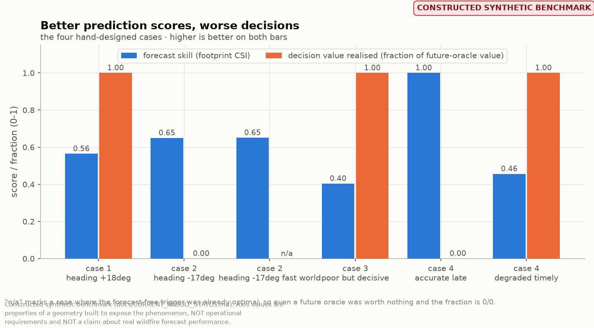
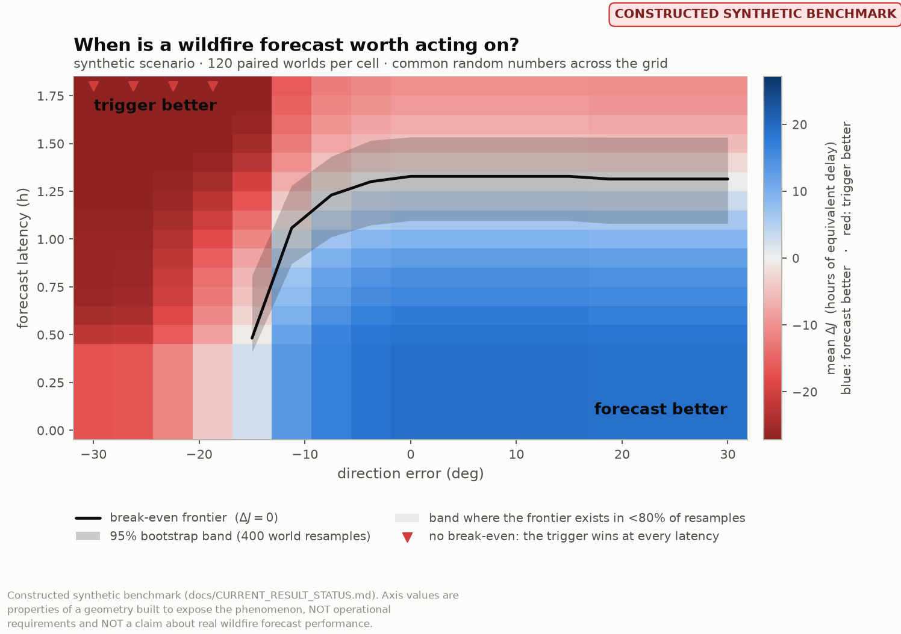
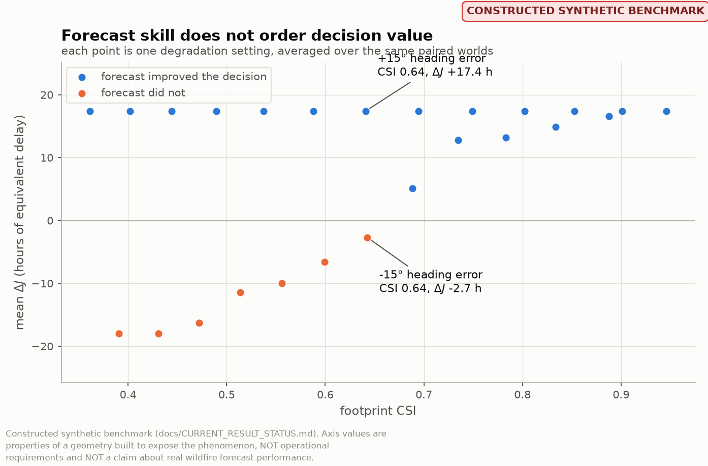

# Decision value

## Definitions

For a world `omega` (one synthetic fire realisation and the community that
must evacuate it):

| quantity | definition | meaning |
|---|---|---|
| `J(a, omega)` | downstream loss of action `a` | smaller is better |
| `J_base` | `J(a_baseline(omega), omega)` | what happens with no forecast |
| `J_fc` | `J(a_forecast(omega), omega)` | what happens acting on the forecast |
| `J_oracle` | `J(a*(omega), omega)` | best action in hindsight (**future oracle**) |
| **`Delta J`** | `J_base - J_fc` | **decision value**; `> 0` means the forecast helped |
| `FOV` | `J_base - J_oracle` | **future-oracle value**: what knowing the realised world would be worth |
| `fraction` | `Delta J / FOV` | share of achievable value realised |

"Perfect forecast" appears nowhere in this repository. It is ambiguous between
an error-free estimate of the **present** and an oracle that knows the
realised **future**, and those have different decision values. The four
explicit classes are in `forecast_classes.py`: `PRESENT_STATE_ORACLE`,
`CONDITIONAL_FORECAST`, `DEGRADED_FORECAST`, `FUTURE_ORACLE`. Only the last is
an upper bound, and no forecast system can approach it.

`J` is reported in **hours of equivalent delay**: travel time enters directly
and a burnover enters as `burnover_loss` hours. Nothing here is money.

### Paired worlds

Both policies are run against the *same* realisation — same fire, same
receptors, same departure schedule. Only the information differs. Pairing
removes world-to-world variance, which is enormous here (whether route A is
overrun at all swamps everything else), and it is what makes a few hundred
worlds informative instead of a few hundred thousand. **Every statistic
downstream is a statistic of the paired difference, never of `J_base` and
`J_fc` as two samples.**

### Why the fraction, not just the difference

`Delta J = 0.3 hours` is meaningless without knowing whether a future oracle
was worth 0.31 hours or 31. The fraction is reported wherever
`FOV > 0` and is `nan` where the baseline was already optimal. A world in
which even a future oracle is worth nothing says nothing about a forecast, and
averaging that `0/0` into the headline as "0% of value realised" would be a
lie about a world that never had an opinion.

## The alternative is half the definition

There is no value of a forecast in the abstract — only its value **compared
with what would otherwise have been done**. The baseline here is a
`ProximityTriggerPolicy`: take the short exposed route unless the *currently
burned area* is within `trigger_distance` of it, in which case take the robust
one.

This is deliberately not a straw man. It responds to the fire, it costs
nothing to run, and over a large part of the error/latency plane it beats the
forecast outright. Producing that region is a *result*, not a failure.

Its weakness is structural rather than parametric: distance now is a poor
proxy for arrival time later when the fire is fast or the route is long. No
choice of `trigger_distance` repairs that, which is precisely why a region
exists where the forecast wins.

`validation.invariants.check_baseline_is_forecast_free` re-runs the baseline
with the forecast stream emptied and asserts the decision is unchanged — the
baseline cannot quietly become a forecast.

## Latency is availability

`ForecastPolicy` consults only releases with `s + delta <= t_d`. If none
exists it returns *exactly* the baseline's decision.

**So the decision value of a too-late forecast is zero, not negative.** An
absent forecast does not make the decision maker worse informed than someone
who never had one; it makes them exactly as informed. Negative decision value
arises the other way: when a forecast *is* available, is believed, and is
wrong in a way the trigger was not.

With `max_wait > 0` the decision maker will hold the evacuation order for a
release that has not landed. Waiting is not free: departures shift by the
wait, the fire keeps spreading, and in the packaged scenario a delay of about
0.95 h closes the robust route as well. That is the mechanism by which latency
costs something continuously.

## Loss-function arbitrariness

There is no correct `J`. The exchange rate between "evacuees spent an extra
twenty minutes on the road" and "an evacuee was overrun by fire" is an ethical
and political choice, not a measurement. This repository takes three positions,
all deliberate:

1. **`J` is an explicit, serialisable object.** Every result frame and
   manifest carries the loss parameters that produced it. A decision-value
   number quoted without its loss function is not a result.
2. **The headline is relative to a stated `J`, never absolute.** Statements of
   the form "this forecast is worth using" are always "…under this loss".
3. **Sensitivity to `J` is a first-class output**, not a robustness appendix.
   `loss_ratio_sweep` re-runs a comparison across a range of
   `burnover_loss / time_cost` ratios. A frontier that moves under a
   factor-of-two change in the ratio is a frontier about the analyst.

`J` is invariant to a common rescaling of both weights, so the model has **one
effective parameter**, the loss ratio `L / c_t`, not two.

## The four cases

Deterministic, one world each, asserted in `tests/test_cases.py`. Run them
with `wg-forecast-value cases`.

> Everything in this section is `CONSTRUCTED_BENCHMARK`
> (`CURRENT_RESULT_STATUS.md`). The heading offsets, the fire speed and the
> latency were selected to exhibit the phenomena; `PARAMETER_PROVENANCE.md`
> records which and how.

All four use the same nominal world: ignition at the origin, heading `+5 deg`,
spread 6 km/h, 30-degree half-angle, decision at `t = 1 h`. In that world route
A is overrun for 29 of 40 receptors, route B is safe, the trigger does not
fire, and so the baseline is **wrong**: `VPI = 36.1 h`.

### Case 1 — prediction metrics move, the action does not

*Arm classes: `PRESENT_STATE_ORACLE` (reference) and `DEGRADED_FORECAST`.*

A `+18 deg` heading error. Footprint CSI falls `1.00 -> 0.57`; the false-alarm
ratio rises `0.00 -> 0.30`; arrival-time RMSE stays at **exactly zero**,
because a pure rotation does not change the distance to any cell that both
fields burn. The selected action is unchanged, and the decision value is
identical to the present-state-oracle arm's.

*Error that lands away from the decision boundary is invisible to the
decision — and RMSE cannot see this error at all.*

### Case 2 — a small error flips the optimal decision

A `-17 deg` heading error: **one degree smaller in magnitude than Case 1's**,
and scoring **better** on CSI (0.65 vs 0.57) and better on FAR (0.10 vs 0.30).
It rotates the wedge boundary just off route A, so the forecast predicts route
A safe, the decision flips to the exposed route, and every hour of value the
forecast could have delivered is lost: `fraction` goes `1.00 -> 0.00`.

A second arm runs the same error in a faster world (spread 7 km/h) where the
trigger fires correctly on its own. There the forecast is not merely valueless
but **actively harmful**: `Delta J ~ -50 h`.

*Two heading errors of almost identical magnitude, the better-scoring one
being the catastrophic one.*

### Case 3 — a clearly poor forecast still makes the right call

60% too fast, displaced 3 km, 10 degrees off. It scores **worse than every
other forecast in these cases** (CSI 0.40, FAR 0.60) and still selects the
correct protective action, realising 100% of the available value.

*Large error in a direction the decision does not resolve costs nothing.*

### Case 4 — the more accurate forecast is worth less, because it is late

Two forecasts of the same world. The first is a `PRESENT_STATE_ORACLE`
(RMSE 0, CSI 1.00) with 0.5 h of latency, so at the decision time it does not exist: the decision maker
falls back to the trigger and realises **zero** value. The second is markedly
worse (CSI 0.46) but arrives in time and realises **all** of it.

*A score penalty on latency cannot produce this ordering. Only availability
can.*

### The inversion, read together

| forecast | CSI | value realised |
|---|---|---|
| Case 4, accurate but late (`PRESENT_STATE_ORACLE`) | **1.00** | **0%** |
| Case 2, `-17 deg` (fast world) | 0.65 | harmful (`Delta J ~ -50 h`) |
| Case 2, `-17 deg` | 0.65 | 0% |
| Case 1, `+18 deg` | 0.57 | **100%** |
| Case 4, degraded but timely | 0.46 | **100%** |
| Case 3, poor combination | **0.40** | **100%** |

**Every forecast that realises all of the available value scores worse on CSI
than every forecast that realises none of it.** The ranking is exactly
inverted. `tests/test_cases.py::test_skill_ranking_is_inverted_against_value`
asserts it, so the claim cannot quietly become false.

## The break-even frontier

The set where `Delta J = 0`: the forecast and the forecast-free trigger are
worth the same. On one side the forecast deserves to change the decision; on
the other the trigger should be left alone.

### Why the frontier is not assumed monotone

Two concrete mechanisms make it non-monotone in this very model:

* **Wedge boundaries sweep past assets.** Decision value can fall as a
  boundary approaches an asset, recover once it has passed, and fall again at
  a second asset. A column can cross zero two or three times.
* **Latency acts through a step.** Crossing `s + delta = t_d` collapses
  `Delta J` to exactly zero discontinuously. A bisection assuming one sign
  change converges happily to a point on the wrong side of such a step.

So `zero_crossings` returns **every** crossing, columns with no crossing are
reported as such rather than dropped, and `monotonicity_report` *measures* how
far a surface is from monotone instead of assuming an answer. The shipped
sweep reports `columns_monotone: True` and `n_columns_no_crossing: 4`; a
shorter `max_wait` produces columns with two crossings, and both configurations
are kept in `experiments/manifests/`.

### Reading the frontier figure

* **Blue** — the forecast is better. **Red** — the trigger is better. The
  neutral midpoint is pinned exactly at `Delta J = 0`, so the colour change is
  the frontier.
* **The black line** is the estimated break-even latency per column, with a
  95% cluster-bootstrap band around it.
* **Red triangles** mark columns where there is no break-even at all: the
  trigger wins at every latency. Interpolating a frontier through them would
  invent one.
* Columns where the bootstrap found a crossing in fewer than 80% of
  resamples are drawn faded. There the frontier *exists* only sometimes, and
  the band is not the whole uncertainty.

The asymmetry in **sign** is the finding. Positive heading errors are nearly
free in this construction, while sufficiently negative ones make the forecast
worse than the trigger at every latency. A summary reporting `|eps_theta|`
would have averaged the two halves together and destroyed it.

The **axis values are constructed, not measured.** The flat section near
1.32 h, the 0.48 h crossing at `-15 deg`, and the `-19 deg` point beyond which
no break-even exists are arithmetic on a route corner at bearing 18.43 deg, a
chosen 30 deg wedge half-angle, a 1.6 h waiting window and a robust route made
cuttable at about 0.95 h of delay. See `PARAMETER_PROVENANCE.md`. **None of
them is a requirement on any real forecast system**, and
`CURRENT_RESULT_STATUS.md` lists them as values that must not be quoted
operationally.

## Skill against value, directly

Each point is one direction-error setting averaged over the same paired
worlds. Two settings with **identical** footprint CSI of 0.64 give
`Delta J = +17.4 h` and `Delta J = -2.7 h`. The relation between skill and
decision value is not a function.
